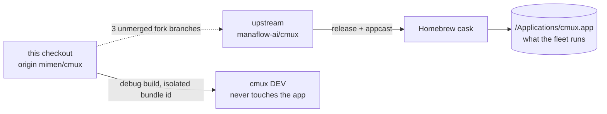

# cmux-fork

`cmux` is a Ghostty-based native macOS terminal with vertical tabs, agent
notifications, a scriptable in-app browser, a CLI and socket control API, and
sidebar extensions. This directory is a fork clone: `origin` is `mimen/cmux`, a
GitHub fork of upstream `manaflow-ai/cmux`, which Manaflow owns, not Milad. Two
facts govern all work here and both are easy to get wrong. The fleet does not run
this checkout. And the local work is one small unmerged feature aging against an
upstream that has moved roughly 1700 commits past it.

## Components

Roughly nine independently operated components, not the three an earlier inventory
recorded. That inventory omitted the Rust `cmux-tui` multiplexer entirely, which
has its own crate workspace, CI, and npm, PyPI, and crates release trains, and no
build relationship to the macOS app.

| Component | Path | What it is | Surfaces |
|---|---|---|---|
| macOS desktop app | `Sources/`, `CLI/`, `Packages/macOS/`, `cmux.xcodeproj` | The native Swift/AppKit terminal, its `cmux` CLI, socket API, in-app browser, and sidebar host. The component the fleet depends on, via upstream. | desktop, cli-tui, api |
| `cmux-tui` | `cmux-tui/crates/` | Rust tmux-style multiplexer. Ships as `npx cmux` / `uvx cmux`, independent of the app. Its own Cargo workspace. | cli-tui |
| SDK bindings | `cmux-tui/bindings/` | Five language bindings, own `cmux-sdk-v*` tag namespace and runbook. A separate release train of `cmux-tui`. | library |
| iOS client | `ios/`, `Packages/iOS/` | Not assessed. Delegated exploration did not return; recorded as such rather than guessed at. | mobile |
| web and cloud services | `web/`, `workers/presence`, `services/iroh-relay-minter` | Not assessed, same reason. This is where the repo's genuinely irreversible operations live. | web, api, backend-data |
| auxiliary subprojects | `vault/`, `daemon/remote`, `cmux-browser/`, `agent-chat/`, `webviews/`, `Native/` | Assessed. Decomposes further into two standalone shipped products, a runtime sidecar, two build inputs, and inert reference trees, which is most of the gap between three and nine. | cli-tui, resident, api, web, desktop, library |

## How they relate

Nothing in this checkout feeds the running app. The macOS app and `cmux-tui` share
the repository and little else: a repo-root `cargo build` does not build the TUI,
whose workspace root is `cmux-tui/Cargo.toml` and whose every documented command
begins `cd cmux-tui`.

## What the components share

**The fleet does not run this checkout.** `/Applications/cmux.app` is installed
through the Homebrew cask and auto-updates from upstream's appcast, whose
`SUFeedURL` points at `manaflow-ai/cmux`. This checkout is a version behind it,
0.64.20 against the installed 0.64.22. A change made here reaches the terminal
Milad actually uses only by landing upstream and shipping in an upstream release.
There is no local build path to the running app, and tagged debug builds use a
distinct bundle id and app name so they cannot clobber it.

**The fork boundary is small and safe, but aging.** Local `main` is exactly
`origin/main` at a 2026-07-24 upstream commit with zero commits authored by Milad,
and the clone has never fetched since 2026-08-12. The local work is 32 commits on
three fork branches (`feat/web-sidebar-panel` and two siblings), all pushed to
`origin`, so nothing is at risk of being lost. They are one coherent feature,
HTML/web custom sidebars, touching 62 files. They are unmerged and were cut from a
base now roughly 1700 commits behind upstream, and they touch
`cmux.xcodeproj/project.pbxproj` and `Resources/Localizable.xcstrings`, two
high-churn merge hazards. So the exposure is that the work becomes unmergeable, not
that it is lost, and it worsens the longer it waits.

**A raw branch diff badly overstates the local footprint.** `git diff` between
`main` and a feature branch reports roughly 4844 files and about a million lines
changed. Almost all of that is upstream drift the stale `main` has not caught up
to, not Milad's work. The real change surface is the 62 files above. Anyone reading
the raw stat will overestimate the local footprint by three orders of magnitude.

**This checkout has never been set up, so the macOS app cannot currently be built
from it.** `scripts/setup.sh` has never run here: all three submodules (`ghostty`,
`homebrew-cmux`, `vendor/bonsplit`) are uninitialized, git hooks are unset, and
`GhosttyKit.xcframework` is absent. `cmux-tui` is blocked the same way by the
missing `ghostty` submodule, plus a pinned-zig mismatch (0.15.2 required, 0.16.0 on
this host).

## Operating notes that span components

Run TUI commands from `cmux-tui/`, never the repo root. Legacy `mux` naming is
still live there: config fallback `mux.json`, `CMUX_MUX_*` env vars, and the
`mux-sdk-v*` tag prefix.

Fork tooling still hardcodes upstream. `scripts/run-e2e.sh`, `scripts/bump-version.sh`,
and the release path all target or read from `manaflow-ai/cmux`, so running release
or e2e tooling from this fork acts on Manaflow's infrastructure, not Milad's. These
hardcodes are correct upstream; they are fork-operability hazards only here.

## Repo-level gaps

CI is effectively paused upstream. Of 41 workflows, only `cmux-browser.yml` carries
a `pull_request` trigger; `ci.yml`, `cmux-tui.yml`, and the rest were switched to
`workflow_dispatch` in a July 2026 pause, so none of the real Swift, Rust, Go, or
web checks runs on a PR or a push. The full Swift suite additionally refuses to run
outside a dedicated `cmux-vm` host, which is not configured on this machine.

Whether the 32 local commits landed upstream is unverified: confirming it needs a
network fetch this audit did not perform, and branch naming is not evidence of a
merge.
